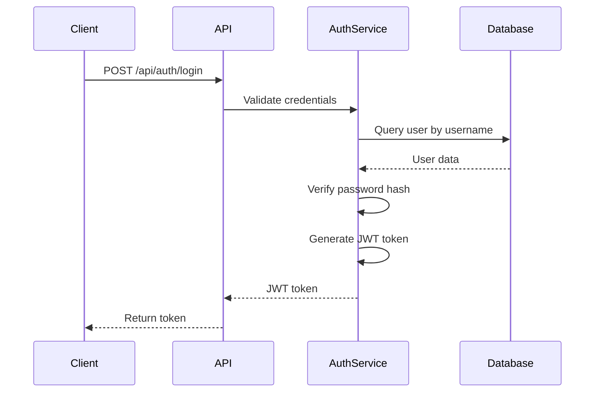
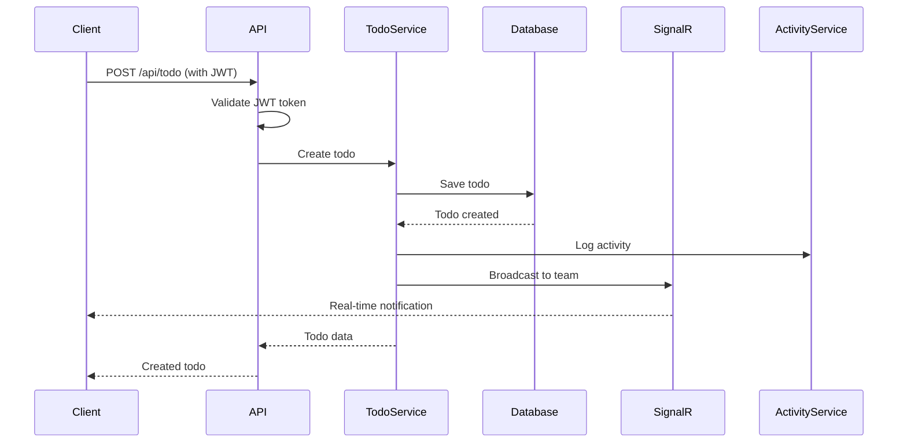
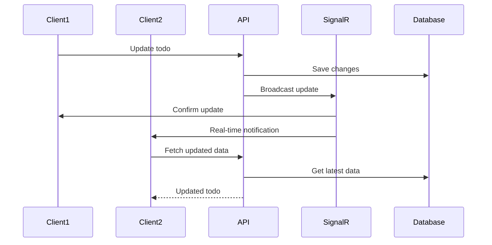
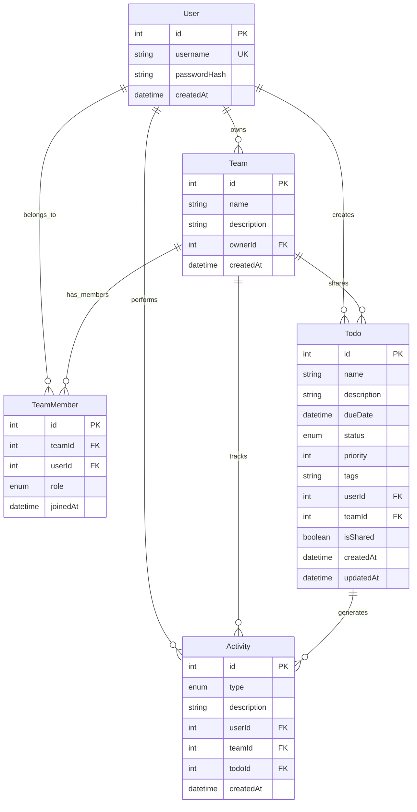
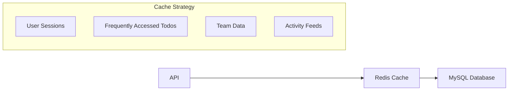
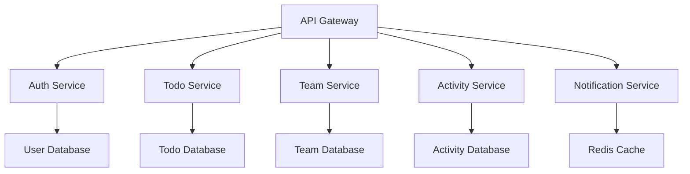
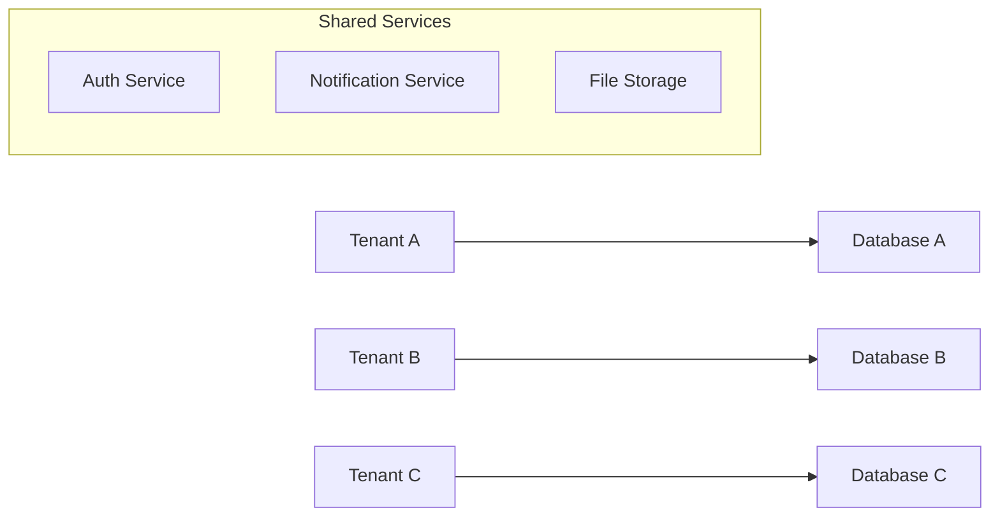
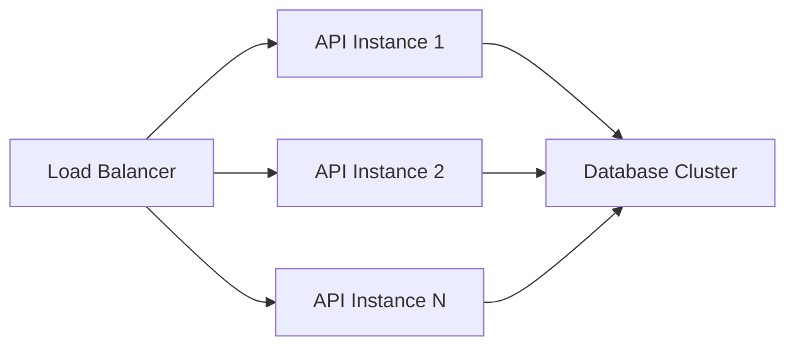
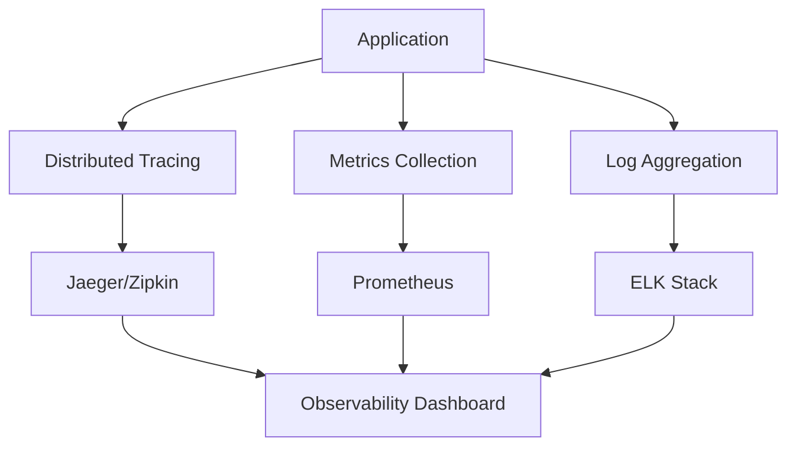

# 🏗️ TodoApi System Design & Architecture

> **ASP.NET Core 8.0** • **SignalR** • **Entity Framework Core** • **MySQL** • **JWT Authentication**

## 📋 Table of Contents

- [System Overview](#system-overview)
- [Current Architecture](#current-architecture)
- [Technology Stack](#technology-stack)
- [Data Flow](#data-flow)
- [Database Design](#database-design)
- [Security Architecture](#security-architecture)
- [Real-time Communication](#real-time-communication)
- [Performance Considerations](#performance-considerations)
- [Future Enhancements Blueprint](#future-enhancements-blueprint)
- [Scalability Roadmap](#scalability-roadmap)
- [Monitoring & Observability](#monitoring--observability)

---

## 🎯 System Overview

TodoApi is a collaborative task management system designed for teams to work together on shared todos with real-time updates. The system supports:

- **Multi-user collaboration** with role-based access control
- **Real-time synchronization** via SignalR
- **Comprehensive audit trail** with activity logging
- **Scalable architecture** ready for enterprise deployment
- **RESTful API** with JWT authentication

### Core Features
- ✅ User authentication and authorization
- ✅ Personal and team-shared todos
- ✅ Real-time notifications and updates
- ✅ Role-based team management
- ✅ Activity tracking and audit logs
- ✅ Advanced filtering and sorting

---

## 🏛️ Current Architecture

### High-Level Architecture Diagram

```
┌─────────────────┐    ┌─────────────────┐    ┌─────────────────┐
│   Web Client    │    │  Mobile Client  │    │   API Client    │
│   (React/Vue)   │    │   (React Native)│    │   (Postman)     │
└─────────┬───────┘    └─────────┬───────┘    └─────────┬───────┘
          │                      │                      │
          └──────────────────────┼──────────────────────┘
                                 │
                    ┌─────────────▼─────────────┐
                    │      Load Balancer        │
                    │     (Nginx/HAProxy)       │
                    └─────────────┬─────────────┘
                                  │
                    ┌─────────────▼─────────────┐
                    │    ASP.NET Core API       │
                    │   (TodoApi Application)   │
                    └─────────────┬─────────────┘
                                  │
          ┌───────────────────────┼───────────────────────┐
          │                       │                       │
┌─────────▼─────────┐  ┌─────────▼─────────┐  ┌─────────▼─────────┐
│   SignalR Hub     │  │   JWT Auth        │  │   Business Logic  │
│   (Real-time)     │  │   (Authentication)│  │   (Services)      │
└────────────────────┘  └────────────────────┘  └────────────────────
                                  │
                    ┌─────────────▼─────────────┐
                    │   Entity Framework Core   │
                    │      (Data Access)       │
                    └─────────────┬─────────────┘
                                  │
                    ┌─────────────▼─────────────┐
                    │      MySQL Database       │
                    │     (Primary Storage)     │
                    └────────────────────────────┘
```

### Component Architecture

#### 1. **Presentation Layer**
- **Web Clients**: React, Vue.js, Angular
- **Mobile Clients**: React Native, Flutter
- **API Clients**: Postman, curl, custom SDKs

#### 2. **API Gateway Layer**
- **Load Balancer**: Nginx, HAProxy
- **Rate Limiting**: API throttling
- **CORS Management**: Cross-origin requests

#### 3. **Application Layer**
- **ASP.NET Core 8.0**: Main application framework
- **Controllers**: REST API endpoints
- **Services**: Business logic implementation
- **SignalR Hub**: Real-time communication

#### 4. **Data Access Layer**
- **Entity Framework Core**: ORM framework
- **Repository Pattern**: Data access abstraction
- **Unit of Work**: Transaction management

#### 5. **Data Storage Layer**
- **MySQL Database**: Primary data storage
- **Connection Pooling**: Database connection management

---

## 🛠️ Technology Stack

### Backend Technologies

| Component | Technology | Version | Purpose |
|-----------|------------|---------|---------|
| **Framework** | ASP.NET Core | 8.0 | Web application framework |
| **ORM** | Entity Framework Core | 8.0 | Database access and mapping |
| **Database** | MySQL | 8.0 | Primary data storage |
| **Authentication** | JWT Bearer | 8.0 | Token-based authentication |
| **Real-time** | SignalR | 8.0 | WebSocket communication |
| **Validation** | FluentValidation | 11.3 | Input validation |
| **Mapping** | AutoMapper | 12.0 | Object-to-object mapping |
| **Hashing** | BCrypt.Net-Next | 4.0 | Password hashing |
| **Documentation** | Swagger/OpenAPI | 6.6 | API documentation |

### Frontend Technologies (Client Examples)

| Component | Technology | Purpose |
|-----------|------------|---------|
| **Web Framework** | React/Vue.js | Single-page applications |
| **Mobile Framework** | React Native | Cross-platform mobile apps |
| **Real-time Client** | SignalR Client | WebSocket communication |
| **HTTP Client** | Axios/Fetch | REST API communication |

### Development & DevOps

| Component | Technology | Purpose |
|-----------|------------|---------|
| **Testing** | xUnit, FluentAssertions | Unit and integration testing |
| **CI/CD** | GitHub Actions | Automated testing and deployment |
| **Containerization** | Docker | Application containerization |
| **Monitoring** | Application Insights | Application monitoring |

---

## 🔄 Data Flow

### Authentication Flow



### Todo Creation Flow



### Real-time Update Flow



---

## 🗄️ Database Design

### Entity Relationship Diagram



### Database Schema Details

#### Users Table
```sql
CREATE TABLE Users (
    Id INT PRIMARY KEY AUTO_INCREMENT,
    Username VARCHAR(50) UNIQUE NOT NULL,
    PasswordHash VARCHAR(255) NOT NULL,
    CreatedAt DATETIME DEFAULT CURRENT_TIMESTAMP
);
```

#### Teams Table
```sql
CREATE TABLE Teams (
    Id INT PRIMARY KEY AUTO_INCREMENT,
    Name VARCHAR(100) NOT NULL,
    Description TEXT,
    OwnerId INT NOT NULL,
    CreatedAt DATETIME DEFAULT CURRENT_TIMESTAMP,
    FOREIGN KEY (OwnerId) REFERENCES Users(Id)
);
```

#### TeamMembers Table
```sql
CREATE TABLE TeamMembers (
    Id INT PRIMARY KEY AUTO_INCREMENT,
    TeamId INT NOT NULL,
    UserId INT NOT NULL,
    Role ENUM('Owner', 'Admin', 'Member', 'Viewer') NOT NULL,
    JoinedAt DATETIME DEFAULT CURRENT_TIMESTAMP,
    FOREIGN KEY (TeamId) REFERENCES Teams(Id),
    FOREIGN KEY (UserId) REFERENCES Users(Id),
    UNIQUE KEY UniqueTeamUser (TeamId, UserId)
);
```

#### Todos Table
```sql
CREATE TABLE Todos (
    Id INT PRIMARY KEY AUTO_INCREMENT,
    Name VARCHAR(200) NOT NULL,
    Description TEXT,
    DueDate DATETIME,
    Status ENUM('NotStarted', 'InProgress', 'Completed') DEFAULT 'NotStarted',
    Priority INT DEFAULT 1,
    Tags VARCHAR(500),
    UserId INT NOT NULL,
    TeamId INT,
    IsShared BOOLEAN DEFAULT FALSE,
    CreatedAt DATETIME DEFAULT CURRENT_TIMESTAMP,
    UpdatedAt DATETIME ON UPDATE CURRENT_TIMESTAMP,
    FOREIGN KEY (UserId) REFERENCES Users(Id),
    FOREIGN KEY (TeamId) REFERENCES Teams(Id)
);
```

#### Activities Table
```sql
CREATE TABLE Activities (
    Id INT PRIMARY KEY AUTO_INCREMENT,
    Type ENUM('TodoCreated', 'TodoUpdated', 'TodoCompleted', 'TodoDeleted', 'MemberJoined', 'MemberLeft', 'TeamCreated') NOT NULL,
    Description TEXT NOT NULL,
    UserId INT NOT NULL,
    TeamId INT,
    TodoId INT,
    CreatedAt DATETIME DEFAULT CURRENT_TIMESTAMP,
    FOREIGN KEY (UserId) REFERENCES Users(Id),
    FOREIGN KEY (TeamId) REFERENCES Teams(Id),
    FOREIGN KEY (TodoId) REFERENCES Todos(Id)
);
```

---

## 🔐 Security Architecture

### Authentication & Authorization

#### JWT Token Structure
```json
{
  "header": {
    "alg": "HS256",
    "typ": "JWT"
  },
  "payload": {
    "sub": "user_id",
    "name": "username",
    "iat": 1642234567,
    "exp": 1642839367
  },
  "signature": "HMACSHA256(base64UrlEncode(header) + '.' + base64UrlEncode(payload), secret)"
}
```

#### Role-Based Access Control (RBAC)

| Role | Permissions |
|------|-------------|
| **Owner** | Full team management, member management, todo management |
| **Admin** | Member management, todo management, limited team settings |
| **Member** | Todo creation, editing, viewing, limited team access |
| **Viewer** | Read-only access to team todos and activities |

#### Security Measures

1. **Password Security**
   - BCrypt hashing with salt
   - Minimum password requirements
   - Secure password storage

2. **Token Security**
   - JWT with 7-day expiry
   - Secure token generation
   - Token validation on each request

3. **Data Protection**
   - Input validation with FluentValidation
   - SQL injection prevention via EF Core
   - XSS protection via content encoding

4. **API Security**
   - CORS configuration
   - Rate limiting (planned)
   - Request validation

---

## ⚡ Real-time Communication

### SignalR Architecture

#### Hub Implementation
```csharp
public class TodoHub : Hub
{
    // Join team group for real-time updates
    public async Task JoinTeam(string teamId)
    {
        await Groups.AddToGroupAsync(Context.ConnectionId, $"team_{teamId}");
    }
    
    // Leave team group
    public async Task LeaveTeam(string teamId)
    {
        await Groups.RemoveFromGroupAsync(Context.ConnectionId, $"team_{teamId}");
    }
    
    // Broadcast todo updates to team
    public async Task TodoUpdated(int teamId, TodoReadDto todo)
    {
        await Clients.Group($"team_{teamId}").SendAsync("TodoUpdated", todo);
    }
}
```

#### Real-time Events

| Event | Trigger | Recipients | Data |
|-------|---------|------------|------|
| `TodoCreated` | New todo created | Team members | Todo object |
| `TodoUpdated` | Todo modified | Team members | Updated todo |
| `TodoDeleted` | Todo removed | Team members | Todo ID |
| `MemberJoined` | User joins team | Team members | Member info |
| `MemberLeft` | User leaves team | Team members | User ID |
| `ActivityAdded` | New activity logged | Team members | Activity object |

#### Connection Management

```javascript
// Client-side connection
const connection = new signalR.HubConnectionBuilder()
    .withUrl("/todohub")
    .withAutomaticReconnect()
    .build();

// Event listeners
connection.on("TodoCreated", (todo) => {
    updateTodoList(todo);
});

connection.on("TodoUpdated", (todo) => {
    updateTodoItem(todo);
});
```

---

## ⚡ Performance Considerations

### Current Performance Optimizations

1. **Database Optimization**
   - Indexed foreign keys
   - Query optimization with EF Core
   - Connection pooling

2. **API Optimization**
   - Async/await patterns
   - Efficient data mapping with AutoMapper
   - Pagination for large datasets

3. **Real-time Optimization**
   - SignalR connection pooling
   - Group-based message targeting
   - Automatic reconnection

### Performance Metrics

| Metric | Current | Target |
|--------|---------|--------|
| **API Response Time** | < 200ms | < 100ms |
| **Database Query Time** | < 50ms | < 25ms |
| **SignalR Latency** | < 100ms | < 50ms |
| **Concurrent Users** | 100 | 10,000+ |
| **Database Connections** | 10 | 100+ |

---

## 🚀 Future Enhancements Blueprint

### Phase 1: Performance & Scalability 

#### 1.1 Redis Caching Layer


**Implementation Plan:**
- **Session Storage**: Move JWT tokens to Redis
- **Todo Caching**: Cache frequently accessed todos
- **Team Data**: Cache team member lists
- **Activity Feeds**: Cache recent activities

```csharp
// Redis Service Implementation
public interface ICacheService
{
    Task<T> GetAsync<T>(string key);
    Task SetAsync<T>(string key, T value, TimeSpan? expiry = null);
    Task RemoveAsync(string key);
    Task RemovePatternAsync(string pattern);
}

public class RedisCacheService : ICacheService
{
    private readonly IConnectionMultiplexer _redis;
    
    public async Task<T> GetAsync<T>(string key)
    {
        var value = await _redis.GetDatabase().StringGetAsync(key);
        return JsonSerializer.Deserialize<T>(value);
    }
    
    public async Task SetAsync<T>(string key, T value, TimeSpan? expiry = null)
    {
        var serialized = JsonSerializer.Serialize(value);
        await _redis.GetDatabase().StringSetAsync(key, serialized, expiry);
    }
}
```

#### 1.2 Database Optimization
- **Read Replicas**: Separate read/write operations
- **Connection Pooling**: Optimize database connections
- **Query Optimization**: Add database indexes
- **Data Archiving**: Archive old activities

#### 1.3 API Performance
- **Response Caching**: Cache API responses
- **Compression**: Enable GZIP compression
- **Rate Limiting**: Implement API throttling
- **Pagination**: Optimize large data sets

### Phase 2: Advanced Features 

#### 2.1 Microservices Architecture


**Service Breakdown:**
- **Auth Service**: User authentication and authorization
- **Todo Service**: Todo CRUD operations
- **Team Service**: Team management and member roles
- **Activity Service**: Activity logging and tracking
- **Notification Service**: Real-time notifications

#### 2.2 Advanced Features
- **File Attachments**: Todo file uploads
- **Comments System**: Todo comments and discussions
- **Advanced Search**: Full-text search with Elasticsearch
- **Email Notifications**: Email alerts for important events
- **Mobile Push Notifications**: Push notifications for mobile apps

#### 2.3 Integration Features
- **Webhook Support**: External system integrations
- **API Rate Limiting**: Per-user and per-IP limits
- **OAuth Integration**: Google, GitHub, Microsoft login
- **Third-party Integrations**: Slack, Teams, Discord

### Phase 3: Enterprise Features 

#### 3.1 Multi-tenancy


**Multi-tenant Architecture:**
- **Database per Tenant**: Isolated data storage
- **Shared Services**: Common authentication and notifications
- **Tenant Management**: Admin portal for tenant management

#### 3.2 Advanced Analytics
- **Usage Analytics**: User behavior tracking
- **Performance Monitoring**: Real-time system metrics
- **Business Intelligence**: Team productivity reports
- **Custom Dashboards**: Configurable analytics views

#### 3.3 Security Enhancements
- **Two-Factor Authentication**: TOTP support
- **Audit Logging**: Comprehensive security audit trail
- **Data Encryption**: At-rest and in-transit encryption
- **Compliance**: GDPR, SOC2 compliance features

### Phase 4: AI & Machine Learning 

#### 4.1 Smart Features
- **Todo Suggestions**: AI-powered todo recommendations
- **Priority Prediction**: ML-based priority scoring
- **Deadline Optimization**: Smart deadline suggestions
- **Team Matching**: AI-powered team member suggestions

#### 4.2 Advanced Analytics
- **Predictive Analytics**: Forecast completion times
- **Anomaly Detection**: Identify unusual activity patterns
- **Performance Insights**: Team productivity analysis
- **Resource Optimization**: Workload distribution suggestions

---

## 📈 Scalability Roadmap

### Horizontal Scaling Strategy

#### 1. Load Balancing


#### 2. Database Scaling
- **Master-Slave Replication**: Read/write separation
- **Sharding**: Horizontal database partitioning
- **Connection Pooling**: Optimized database connections

#### 3. Caching Strategy
- **CDN**: Static content delivery
- **Redis Cluster**: Distributed caching
- **Application Caching**: In-memory caching


---

## 📊 Monitoring & Observability

### Current Monitoring

#### 1. Application Monitoring
- **Health Checks**: API endpoint monitoring
- **Error Tracking**: Exception logging
- **Performance Metrics**: Response time tracking

#### 2. Database Monitoring
- **Query Performance**: Slow query detection
- **Connection Pooling**: Connection usage metrics
- **Storage Monitoring**: Database size and growth

### Future Monitoring Enhancements

#### 1. Advanced Observability


#### 2. Monitoring Stack
- **Distributed Tracing**: Jaeger or Zipkin
- **Metrics Collection**: Prometheus + Grafana
- **Log Aggregation**: ELK Stack (Elasticsearch, Logstash, Kibana)
- **Alerting**: PagerDuty or OpsGenie

#### 3. Key Metrics
- **Business Metrics**: User engagement, feature usage
- **Technical Metrics**: Response time, error rates
- **Infrastructure Metrics**: CPU, memory, disk usage
- **Security Metrics**: Failed login attempts, suspicious activity


## 📝 Conclusion

The TodoApi system is designed with scalability, performance, and maintainability in mind. The current architecture provides a solid foundation for future enhancements, while the roadmap outlines a clear path toward enterprise-grade features and capabilities.

### Key Success Factors

1. **Incremental Enhancement**: Phased approach to minimize disruption
2. **Performance First**: Caching and optimization from the start
3. **Security Focus**: Comprehensive security measures
4. **Monitoring Driven**: Observability throughout the system
5. **User-Centric**: Features that enhance user experience

### Technology Evolution

The system is designed to evolve with technology trends:
- **Cloud-Native**: Ready for Kubernetes deployment
- **Event-Driven**: Prepared for event sourcing
- **AI-Ready**: Architecture supports ML integration
- **API-First**: Designed for external integrations

---

*This System Design document serves as a living blueprint for the TodoApi evolution. Regular updates will reflect new requirements and technological advances.* 